# subdivision
## Simple implementation of three most common subdivision algorithms *(and one more)*
### by [Michał Lampert](https://github.com/michlampert/) & [Wojciech Achtelik](https://github.com/WojtAcht/)

- [x] Doo–Sabin
- [x] Catmull–Clark
- [x] Loop
- [x] Peters-Reif

## 1. Step by step effect of Catmull-Clark algorithm

## 2. Statistics and results for Suzanne (Blender monkey)
below images: number of vertices | number of faces | time to compute
| Doo-Sabin | Catmull-Clark | Loop | Peters-Reif |
|---|---|---|---|
| 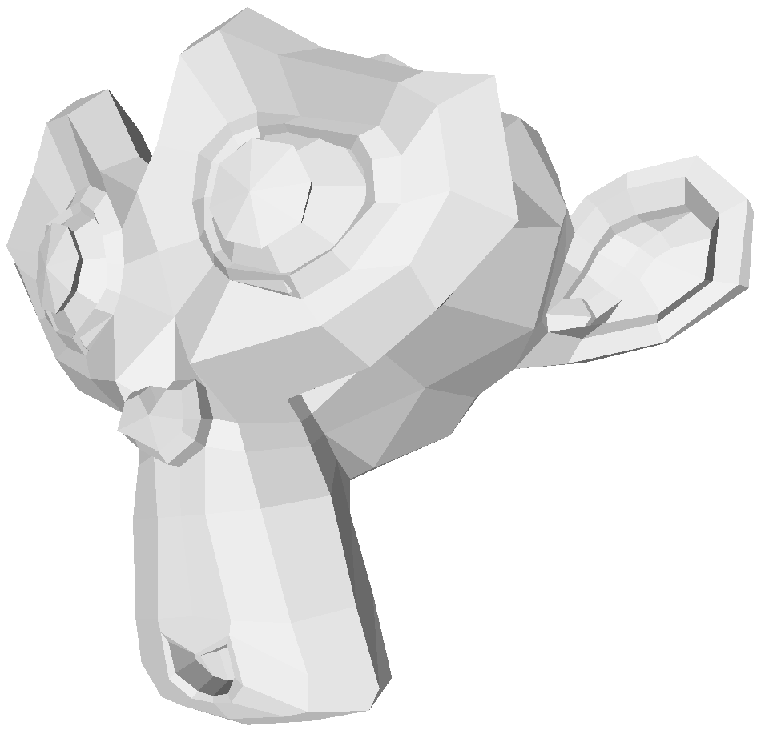 |  | 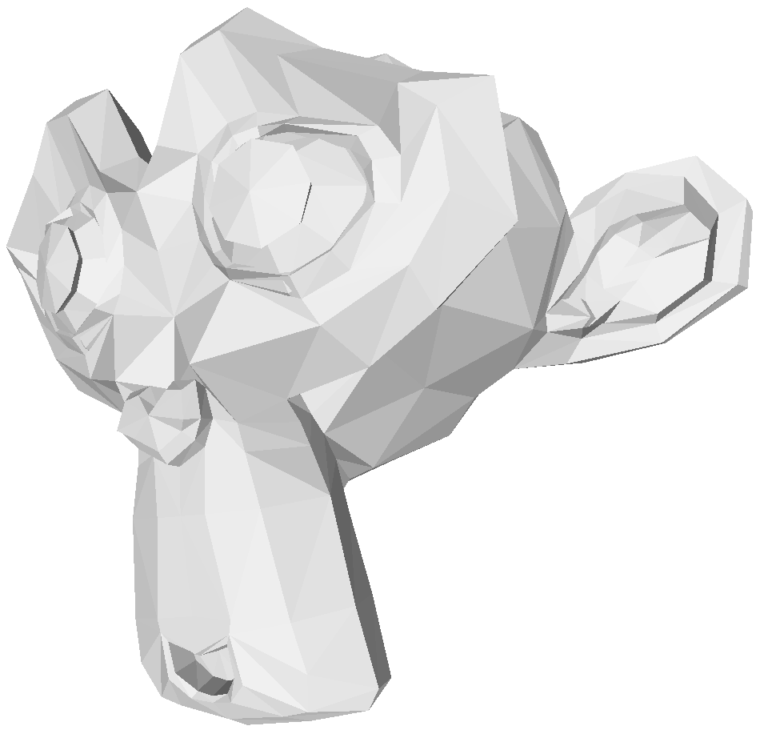 |  |
|    506 \| 500 \| 0 ms |    506 \| 500 \| 0 ms |    506 \| 966 \| 0 ms | 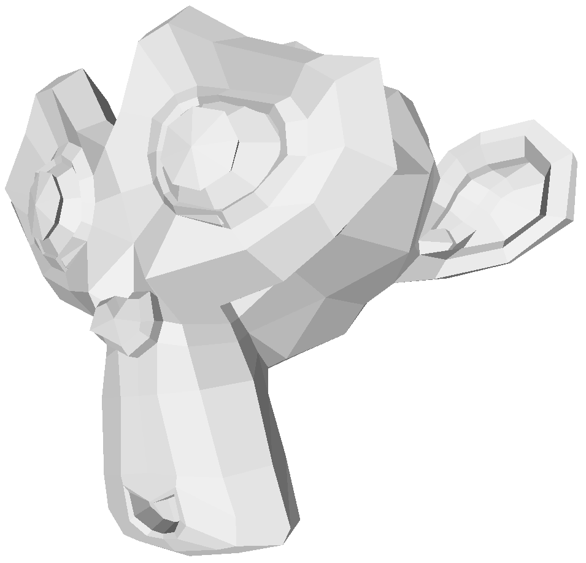   506 \| 500 \| 0 ms |
|    1966 \| 1926 \| 86.52 ms |    2010 \| 1966 \| 0.15 s |    1976 \| 3864 \| 0.18 s | 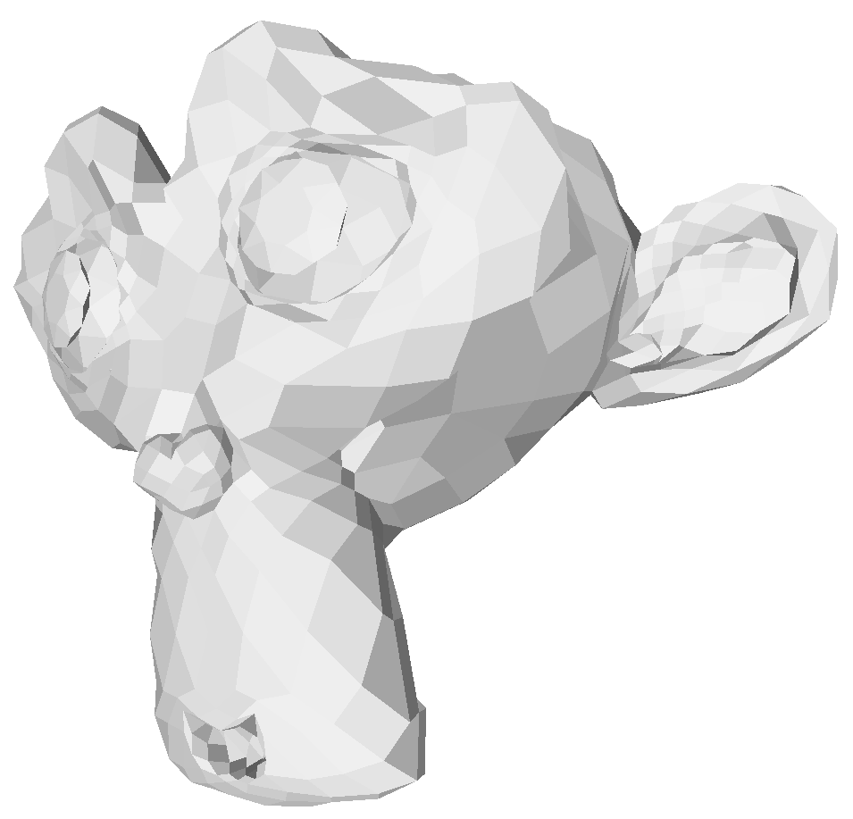   1004 \| 1006 \| 0.15 s |
|    7696 \| 7614 \| 0.4 s |    7950 \| 7864 \| 0.46 s |    7814 \| 15456 \| 0.59 s | 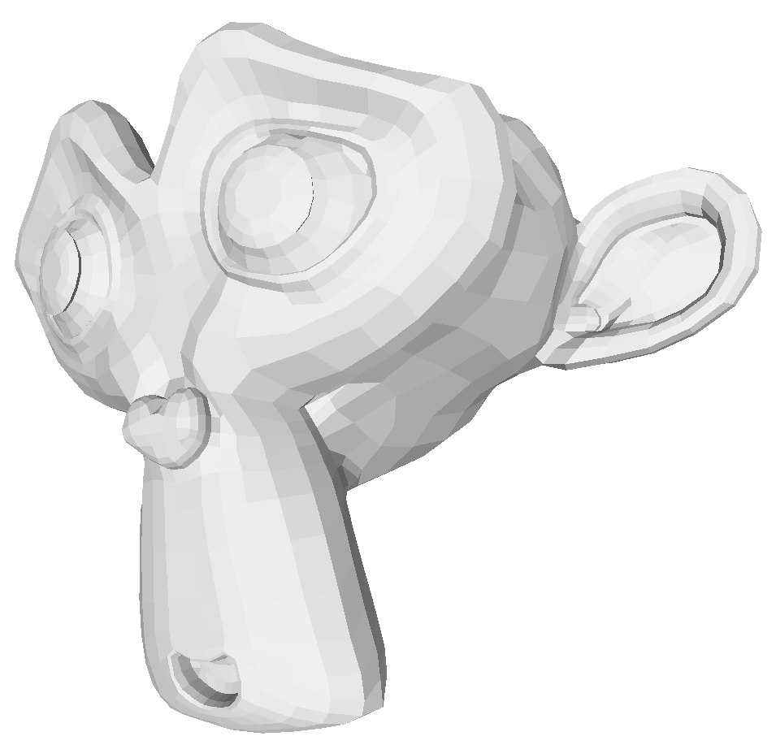   2008 \| 2010 \| 0.26 s |
|    30448 \| 30282 \| 2.78 s |    31626 \| 31456 \| 1.82 s |    31082 \| 61824 \| 2.32 s |    4016 \| 4018 \| 0.47 s |
|    121120 \| 120786 \| 38.28 s |    126162 \| 125824 \| 9.78 s |    123986 \| 247296 \| 14.47 s |    8032 \| 8034 \| 0.93 s |
|    483136 \| 482466 \| 721.48 s |    503970 \| 503296 \| 37.89 s |    495266 \| 989184 \| 51.01 s |    16064 \| 16066 \| 12.21 s |
|   |   |   |    32128 \| 32130 \| 14.05 s |
|   |   |   |    64256 \| 64258 \| 17.59 s |
|   |   |   |    128512 \| 128514 \| 24.39 s |
|   |   |   |    257024 \| 257026 \| 47.95 s |
|   |   |   | 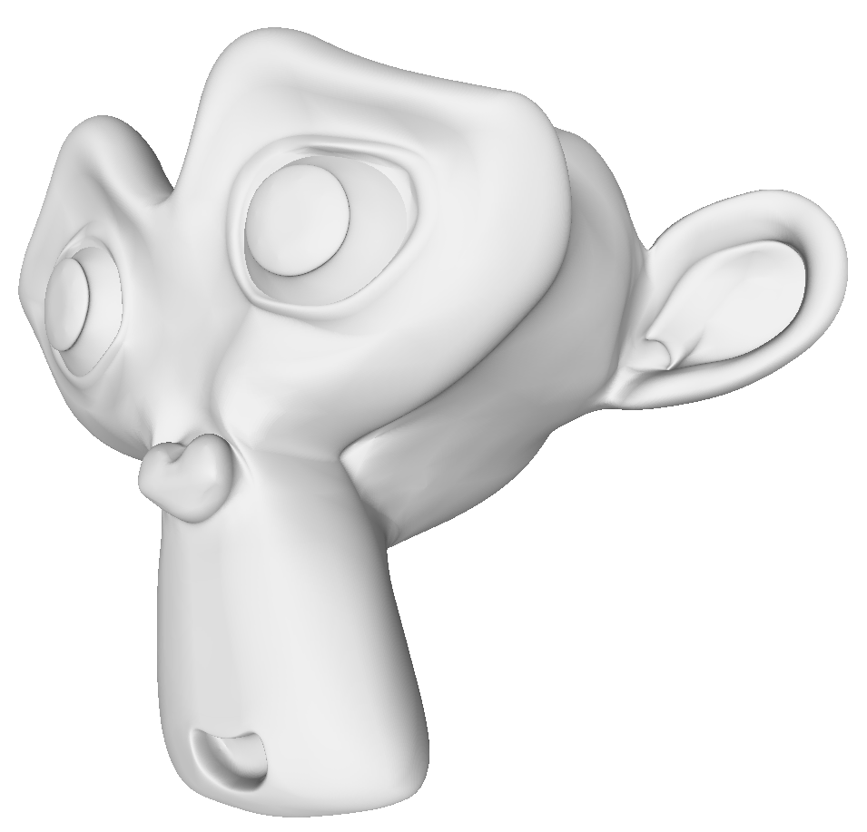   514048 \| 514050 \| 85.45 s |

## 3. Statistics and results for cube
below images: number of vertices | number of faces | time to compute
| Doo-Sabin | Catmull-Clark | Loop | Peters-Reif |
|---|---|---|---|
| 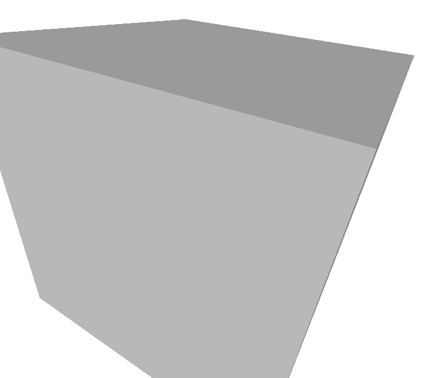 |  |  |  |
|    8 \| 6 \| 0 ms |    8 \| 6 \| 0 ms |    8 \| 12 \| 0 ms | 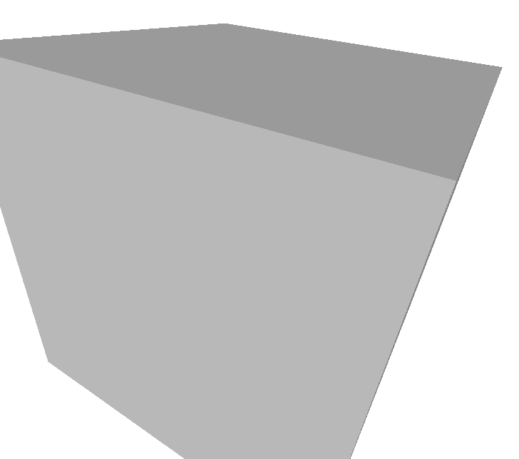   8 \| 6 \| 0 ms |
|    24 \| 26 \| 1.2 ms |    26 \| 24 \| 1.03 ms |    26 \| 48 \| 1.28 ms | 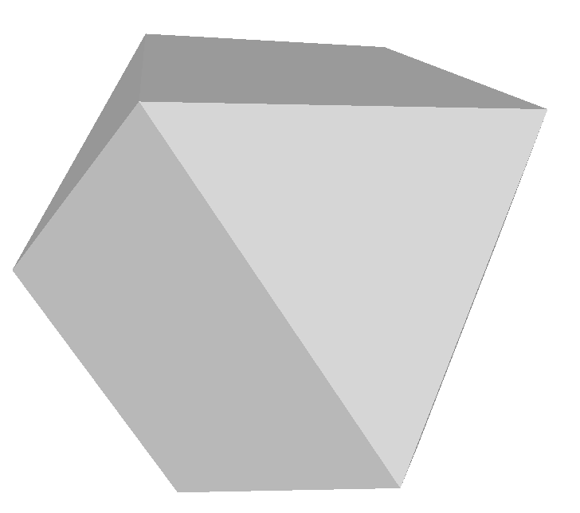   12 \| 14 \| 0.49114 ms |
|    96 \| 98 \| 4.24 ms |    98 \| 96 \| 4.41 ms |    98 \| 192 \| 9.73 ms | 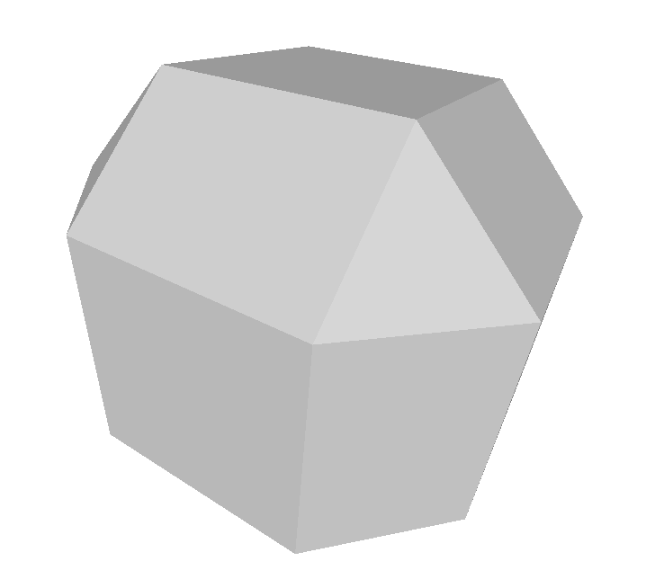   24 \| 26 \| 1.44 ms |
|    384 \| 386 \| 18.25 ms |    386 \| 384 \| 19.62 ms |    386 \| 768 \| 31.93 ms | 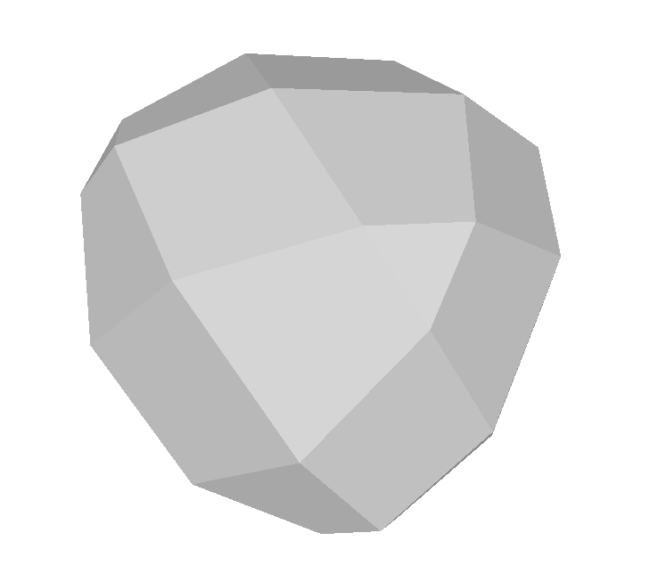   48 \| 50 \| 7.23 ms |
|    1536 \| 1538 \| 72.14 ms |    1538 \| 1536 \| 79.23 ms |    1538 \| 3072 \| 0.1 s | 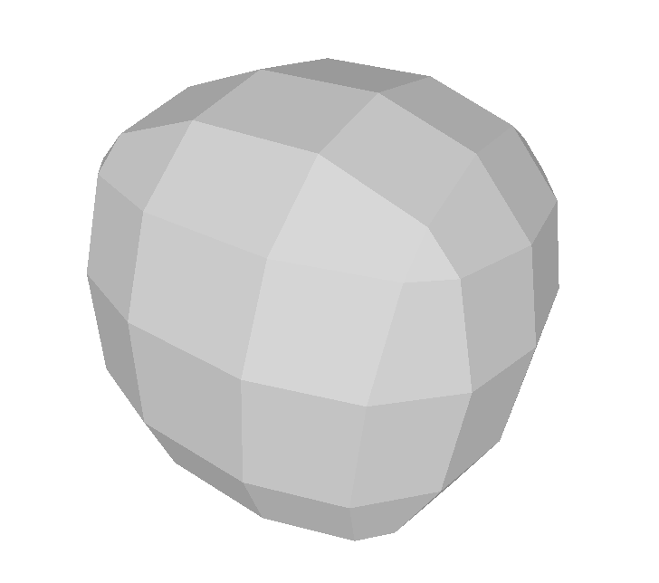   96 \| 98 \| 10.88 ms |
|    6144 \| 6146 \| 0.33 s |    6146 \| 6144 \| 0.35 s |    6146 \| 12288 \| 0.37 s | 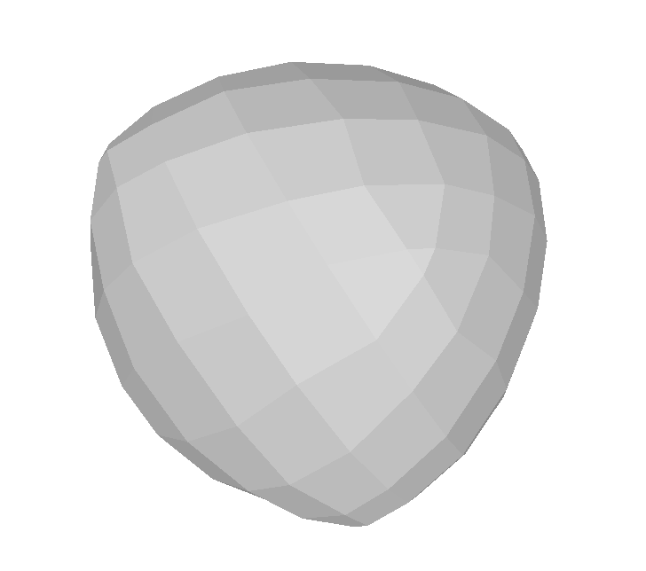   192 \| 194 \| 20.9 ms |
|    24576 \| 24578 \| 2.57 s |    24578 \| 24576 \| 2.02 s |    24578 \| 49152 \| 2.54 s | 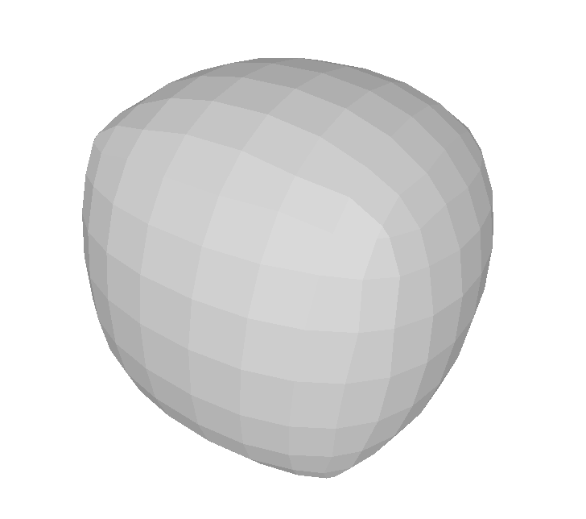   384 \| 386 \| 42.9 ms |
|    98304 \| 98306 \| 27.11 s |    98306 \| 98304 \| 7.83 s |    98306 \| 196608 \| 10.69 s |    768 \| 770 \| 84.71 ms |
|   |   |   |    1536 \| 1538 \| 0.17 s |
|   |   |   | 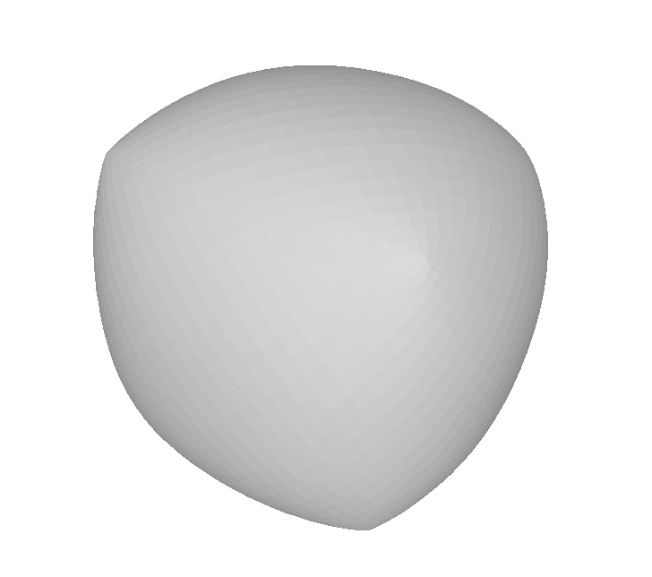   3072 \| 3074 \| 0.31 s |
|   |   |   |    6144 \| 6146 \| 0.54 s |
|   |   |   |    12288 \| 12290 \| 0.99 s |
|   |   |   |    24576 \| 24578 \| 1.86 s |
|   |   |   |    49152 \| 49154 \| 5.86 s |
|   |   |   |    98304 \| 98306 \| 11.65 s |
