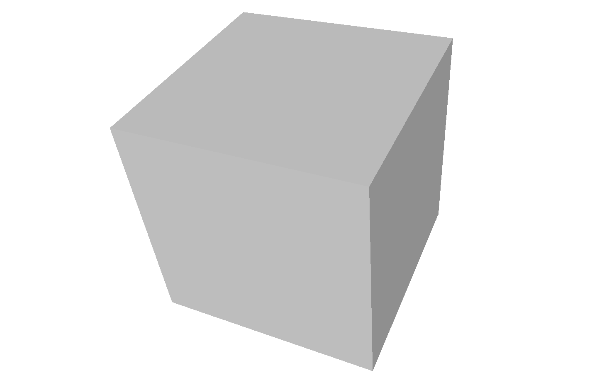
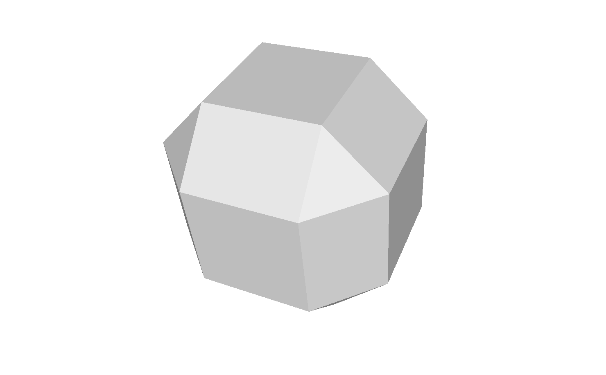
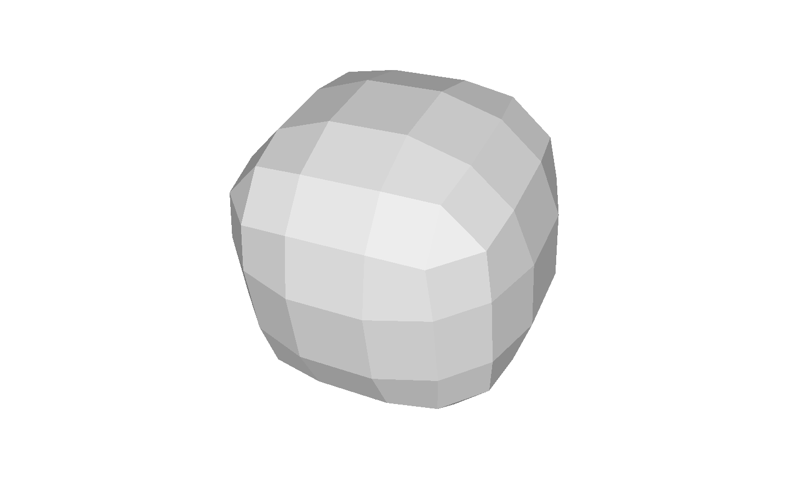
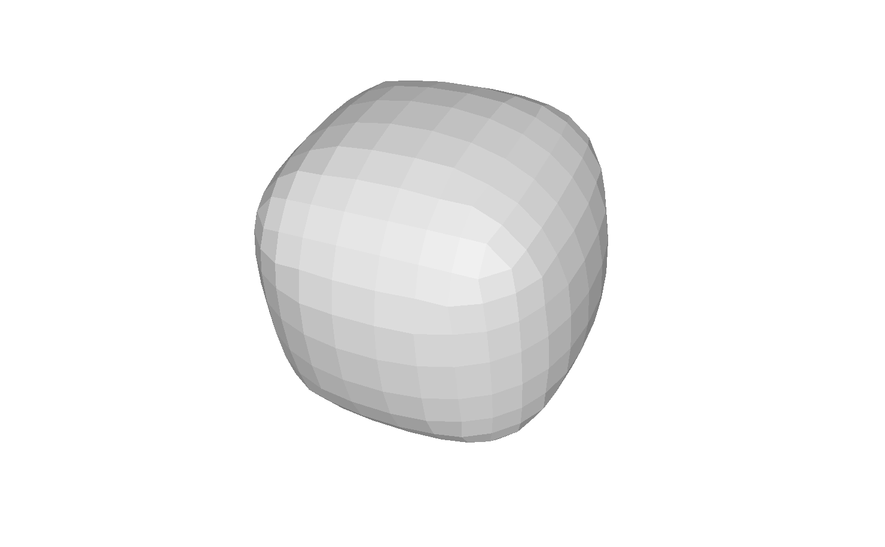
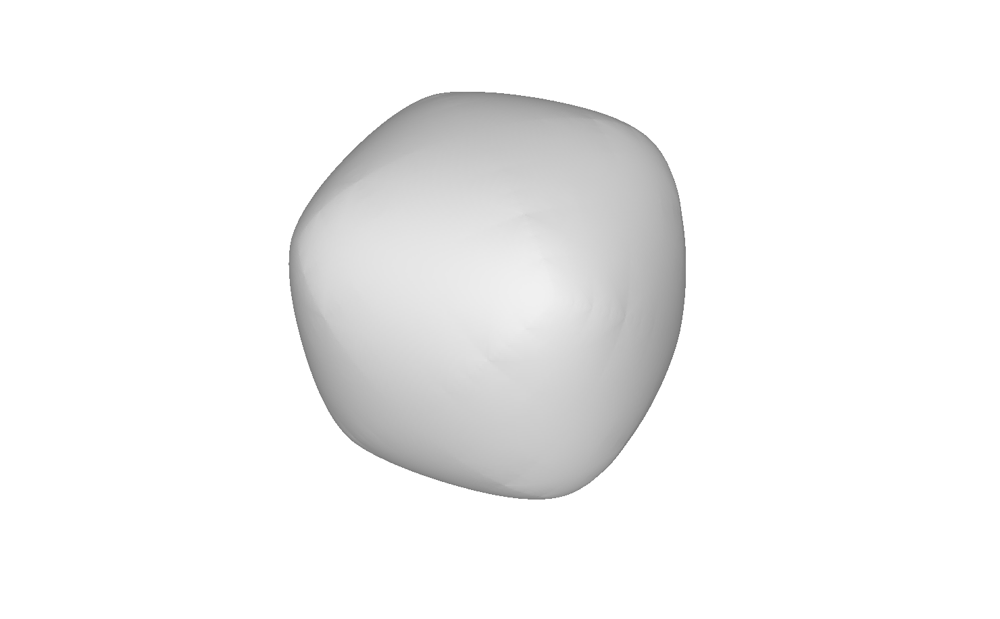

# subdivision

### [Michał Lampert](https://github.com/michlampert/) & [Wojciech Achtelik](https://github.com/WojtAcht/)

| mesh after 0 subdivisions vertices: 8 faces: 6 time to compute: 0 ms |  |
| --- | --- |
| mesh after 1 subdivisions vertices: 24 faces: 26 time to compute: 0.75674 ms |  |
| mesh after 2 subdivisions vertices: 96 faces: 98 time to compute: 3.03 ms |  |
| mesh after 3 subdivisions vertices: 384 faces: 386 time to compute: 10.57 ms |  |
| mesh after 4 subdivisions vertices: 1536 faces: 1538 time to compute: 46.89 ms |  |
| mesh after 5 subdivisions vertices: 6144 faces: 6146 time to compute: 0.2 s |  |
| mesh after 6 subdivisions vertices: 24576 faces: 24578 time to compute: 1.25 s |  |
| mesh after 7 subdivisions vertices: 98304 faces: 98306 time to compute: 19.04 s |  |
