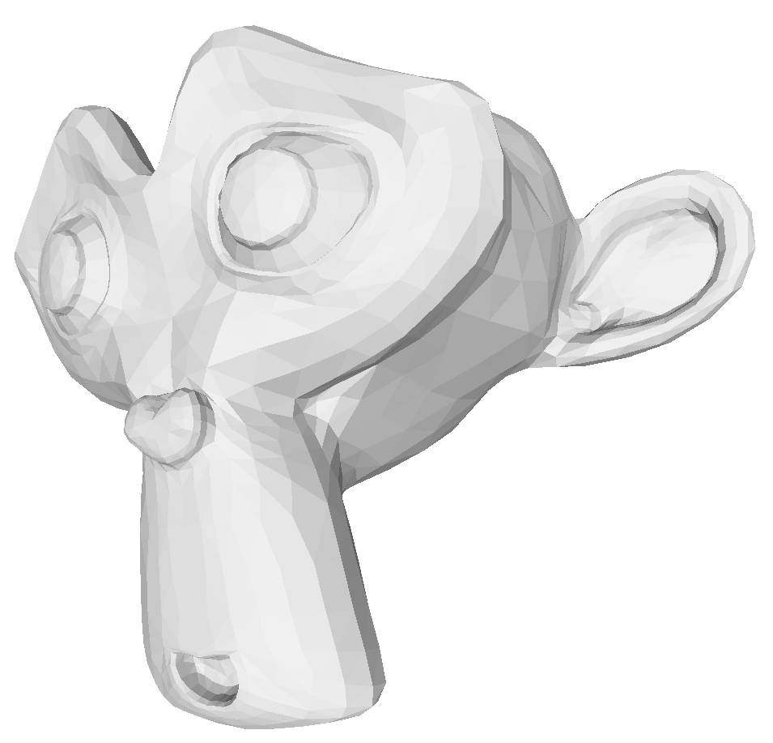
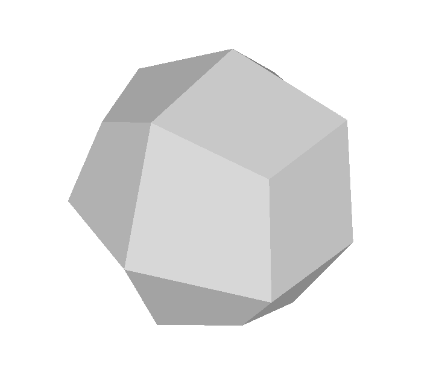

# subdivision
## Simple implementation of three most common subdivision algorithms
### by [Michał Lampert](https://github.com/michlampert/) & [Wojciech Achtelik](https://github.com/WojtAcht/)

- [x] Doo–Sabin
- [x] Catmull–Clark
- [x] Loop

## 1. Step by step effect of Catmull-Clark algorithm

## 2. Statistics and results for Suzanne (Blender monkey)
below images: number of vertices | number of faces | time to compute
| Doo-Sabin | Catmull-Clark | Loop |
|---|---|---|
|    507 \| 500 \| 0 ms |    507 \| 500 \| 0 ms |    507 \| 968 \| 0 ms |
|    1968 \| 1927 \| 27.16 ms |    2012 \| 1968 \| 37.93 ms |    1980 \| 3872 \| 0.13 s |
|    7702 \| 7620 \| 0.15 s |    7958 \| 7872 \| 0.18 s |    7830 \| 15488 \| 0.47 s |
|    30472 \| 30306 \| 1.12 s |    31658 \| 31488 \| 2.71 s |    31146 \| 61952 \| 1.98 s |
|    121216 \| 120882 \| 27.22 s |    126290 \| 125952 \| 6.4 s |    124242 \| 247808 \| 9.78 s |
|    483520 \| 482850 \| 638.77 s |    504482 \| 503808 \| 26.93 s |    496290 \| 991232 \| 34.1 s |
||||

## 3. Statistics and results for cube
below images: number of vertices | number of faces | time to compute
| Doo-Sabin | Catmull-Clark | Loop |
|---|---|---|
|    8 \| 6 \| 0 ms |    8 \| 6 \| 0 ms |    8 \| 12 \| 0 ms |
|    24 \| 26 \| 0.4127 ms |    26 \| 24 \| 0.65184 ms |    26 \| 48 \| 0.76866 ms |
|    96 \| 98 \| 1.73 ms |    98 \| 96 \| 3.87 ms |    98 \| 192 \| 5.18 ms |
|    384 \| 386 \| 8.28 ms |    386 \| 384 \| 11.22 ms |    386 \| 768 \| 15.26 ms |
|    1536 \| 1538 \| 27.7 ms |    1538 \| 1536 \| 36.12 ms |    1538 \| 3072 \| 45.71 ms |
|    6144 \| 6146 \| 0.11 s |    6146 \| 6144 \| 0.13 s |    6146 \| 12288 \| 0.85 s |
|    24576 \| 24578 \| 0.73 s |    24578 \| 24576 \| 0.92 s |    24578 \| 49152 \| 2.0 s |
|    98304 \| 98306 \| 16.61 s |    98306 \| 98304 \| 3.24 s |    98306 \| 196608 \| 5.52 s |
||||
